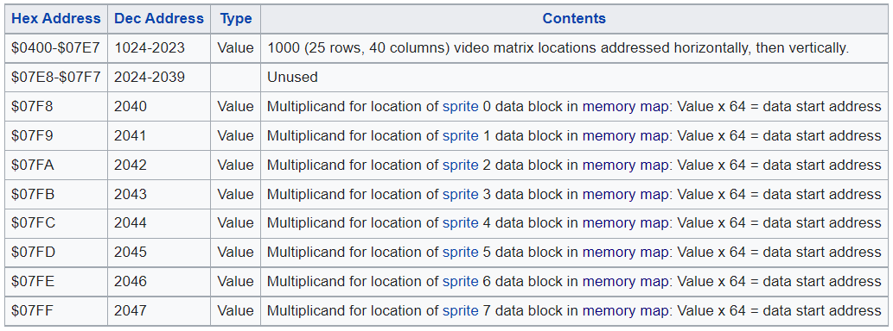
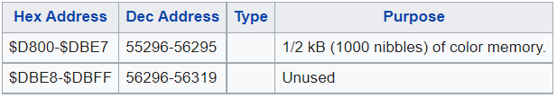
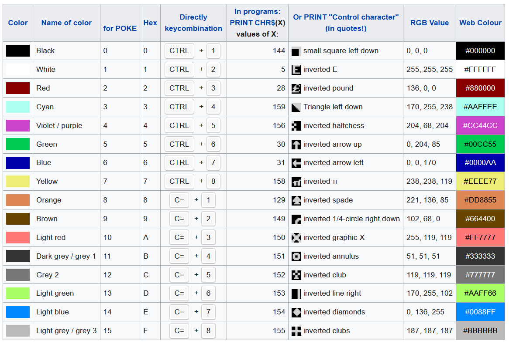
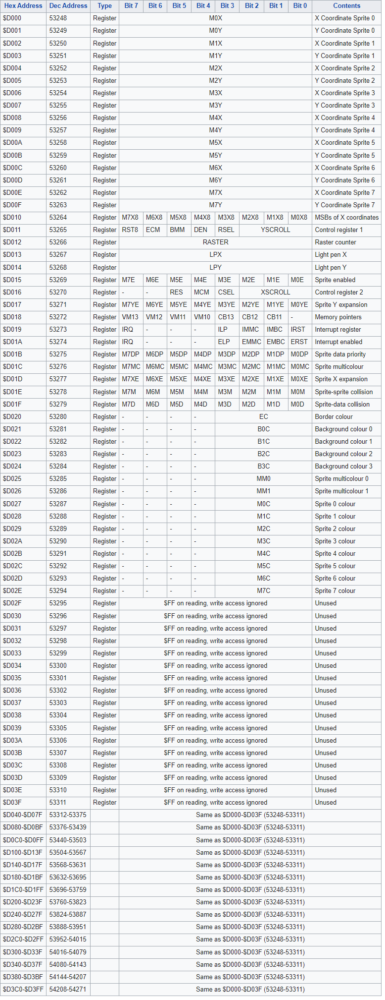
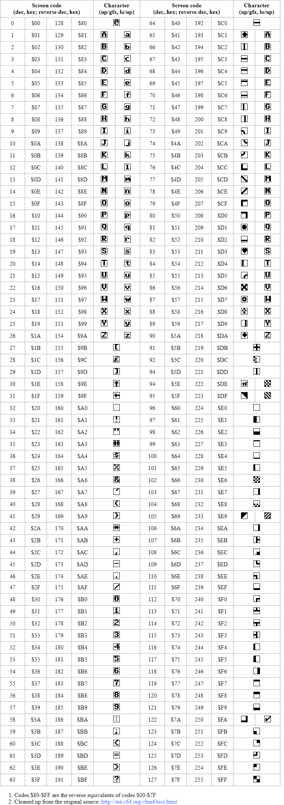

# Screen Memory

## Calculate addresses for displaying multi-line text on the center of screen

These formulas are explained in the file ***calculate_center_of_screen_for_displaying_multi-line_text.md***, which can be found in the
folder docs of this repository
> To calculate the sequence of addresses {$A_0,A_1 ... A_{n-1}$} needed for centering $n$ lines of text (numbered $0$ to $n-1$) on the C64 screen, we can use this formula:
>
> ${(A_i)}_{i=0}^{n-1} = \$0414 + \$0028(\$0C - \frac{n}{\$02}) + \$0028i - \frac{len_i}{\$02}$
>
> where
>
> $A_i$ is the screen address of the first character of the string of line $i$
>
> $n$ is the number of lines of text to display
>
> $len_i$ is the length of the string at line $i$
>
> For colour memory, a similar formula can be used with only the first constant changed.
>
> ${(A_i)}_{i=0}^{n-1} = 0xD814 + 0x28(0x0C - \frac{n}{0x02}) + 0x28i - \frac{len_i}{0x02}$

# Colour Memory

# Colour Codes

# VIC Registers

# Screen Codes

# 6502 Instruction Set

https://www.masswerk.at/6502/6502_instruction_set.html
